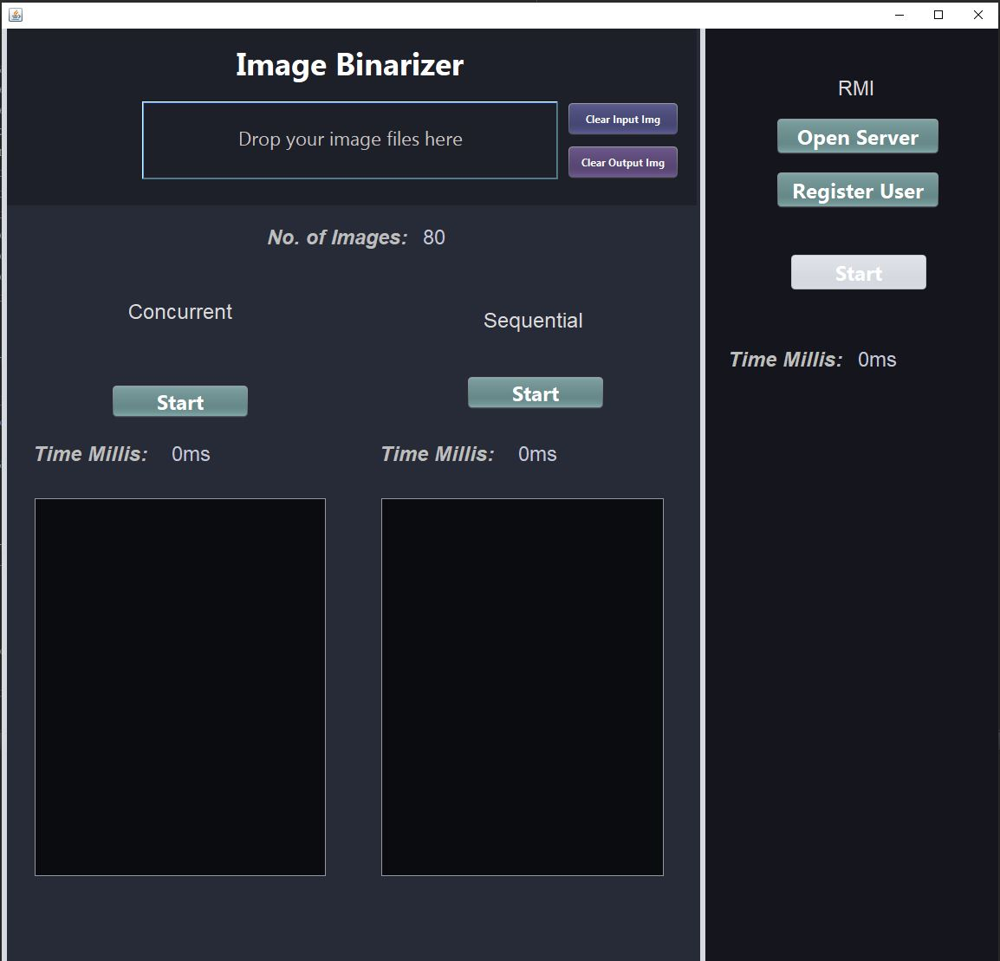
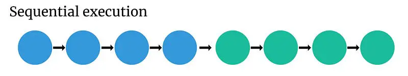
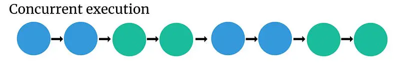
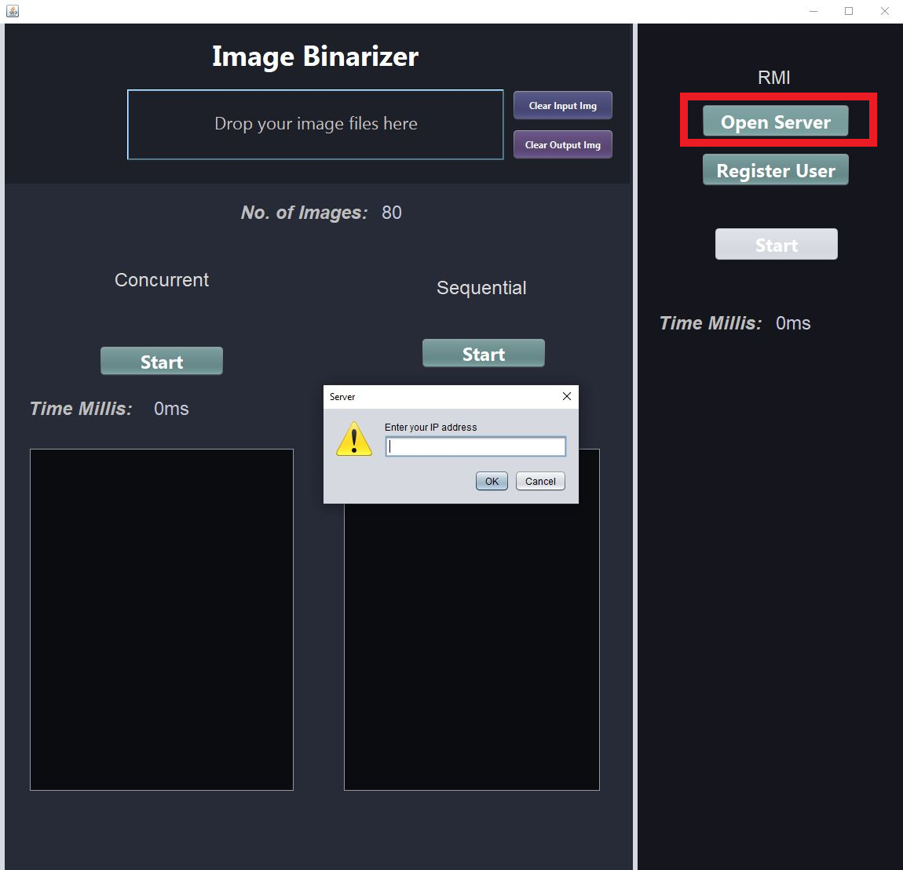
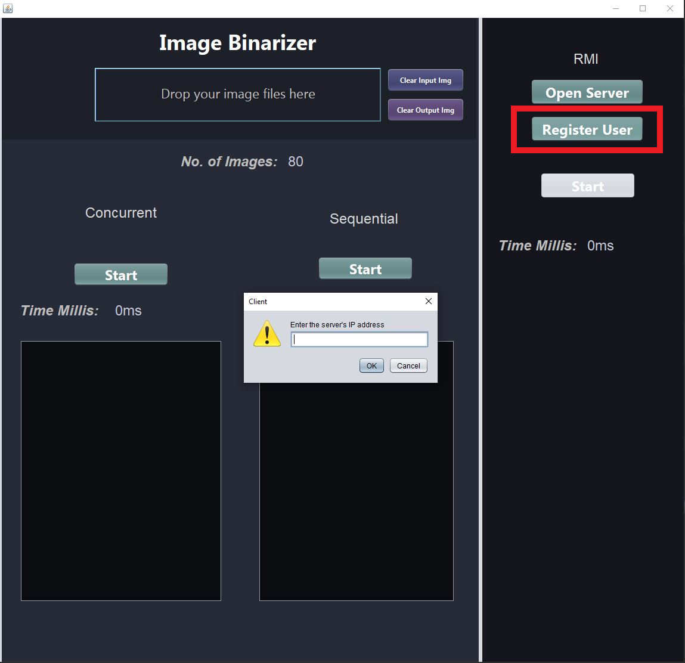

# Image Processor

## Implementation 🚀

<ul>
    <li>Image Drag and Drop Box</li>
    <li>Image Total Counter</li>
    <li>Image Binarization (Black and White Pixels)</li>
    <li>User-Friendly Graphic Interface</li>
    <li>Sequential, Concurrent and Parallel Binarization of images</li>
    <li>Time Comparison Between Multiple Processing Methods</li>
    <li>All Image Deletion with One Click</li>
    <li>After processing, find your processed images conveniently organized in a folder named Output_Images.</li>
</ul>

 
    

## Image Binarization 💡

Image binarization is a fundamental process in computer vision that involves converting a color image into a binary image, where each pixel is represented as either black or white. This technique is widely used in various applications to enhance image features and simplify subsequent processing.

### Possible Usages 📋:

<ul>
    <li><strong>Text Recognition (OCR):</strong> Binarizing images containing text isolates characters from the background, aiding in optical character recognition (OCR) systems.</li>
    <li><strong>Edge Detection:</strong> Binarization is a common step in edge detection, a crucial process in computer vision used to identify boundaries and contours in objects.</li>
    <li><strong>Medical Image Processing:</strong> In medical images such as X-rays, binarization can assist in identifying anatomical structures, tumors, or other anomalies.</li>
    <li><strong>Object Segmentation:</strong> Binarization helps isolate objects of interest in images, such as cell counting in biology or object detection in security images.</li>
    <li><strong>Shape and Pattern Recognition:</strong> For computer vision applications like object classification, binarization simplifies the task by highlighting relevant features.</li>
    <li><strong>Image Compression:</strong> Binarization is employed in some image compression methods to reduce the amount of information needed to represent an image.</li>
    <li><strong>Authentication and Security:</strong> In biometric authentication systems, such as fingerprint recognition or facial detection, binarization extracts key features for verification.</li>
    <li><strong>Document Processing:</strong> Binarization is useful in document-related applications, separating printed text from the background.</li>
    <li><strong>Night Vision:</strong> In night vision systems, binarization enhances the visibility of objects of interest, like people or vehicles, in low-light conditions.</li>
    <li><strong>Barcode and QR Code Decoding:</strong> Binarization is essential in reading barcodes and QR codes, where black and white areas are separated to decode information.</li>
</ul>

## 1. Sequential Processing 🛠️

    Sequential processing executes tasks one after the other in a linear manner, with each task dependent on the completion of the previous one. It is straightforward but may not fully exploit parallel processing capabilities.

 
    

## 2. Concurrent Processing 🛠️

    Concurrent execution allows multiple processes to run at the same time. This doesn’t necessarily mean they run simultaneously (that would be parallelism), but the processes can interleave, allowing parts of different processes to run in an order that can vary. Concurrency can be beneficial because it allows processes to share resources and can improve efficiency by allowing processes to run while others are waiting

 
    

## 3. Parallel Processing (RMI) 🛠️

Parallel processing, specifically Remote Method Invocation (RMI), extends concurrent processing by distributing tasks across multiple interconnected systems. This approach enhances performance for computationally intensive tasks by dividing the workload among multiple processors, reducing overall processing time.  

It's crucial to note that in parallel processing, <b>EACH CLIENT MUST HAVE INDIVIDUAL COPIES OF THE IMAGES TO BE PROCESSED</b>. This is due to the inefficiency of transmitting each image from the server to the clients and then returning the processed images. Having images locally on each client ensures optimal performance and minimizes data transfer overhead.

- First of all, you need to start the program in the assigned machine to be the server.

 
    

- Then, in another machine, click on the "client" button and type the server's address.

 
    

- Once at least one client is connected to the server, you will be able to start RMI processing in the server.